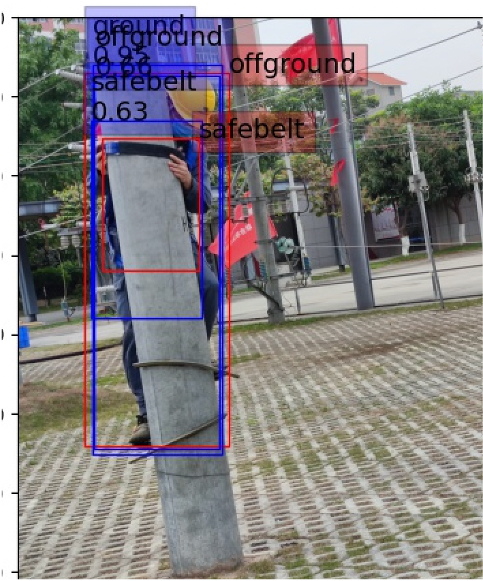
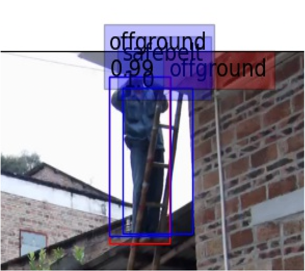
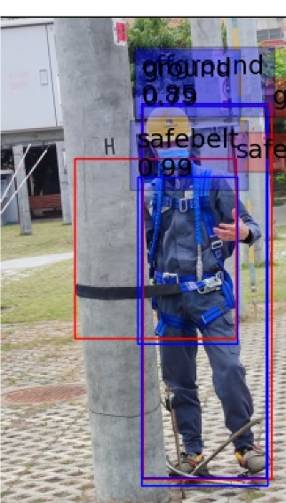
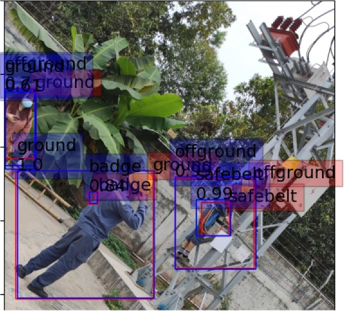

# [Faster-R-CNN](https://arxiv.org/abs/1506.01497)

---

环境：

- backbone：resnet50 + fpn
- network_files：rpn（暂时未理解，理解后会更新）、roi
- train_utils：训练代码
- analysis.py：读取预测结果，对预测的bbox的逐类别的信心分数进行统计
- my_dataset.py：构建Dataset，统计数据集图片的通道平均值和标准差
- my_log.py：日志模块，仅在my_dataset.py中使用
- plot_curve.py：绘制训练过程的loss及mAP的变换图
- predict.py：使用模型推理测试数据集，推理结果保留在test_results/中
- re_infer.py：读取模型推理结果(test_results/、red_results/)，根据赛题要求再推流
- train.py：训练脚本
- validation.py：用于调用训练好的模型权重去计算验证集/测试集的COCO指标，预测结果保留在pred_results/下
- run.sh：启动训练脚本
- val.sh：启动验证脚本
- transforms.py：图像前处理，并未在项目中使用
- tst_draw：对前处理的结果，以及数据集进行可视化

---

本方案仍然存在许多问题尚未解决：

- 遮挡的目标识别错误

  

- safebelt识别准确率和召回率低

  

- ground和offground在某些情况下识别错误

  

    
  

- 

